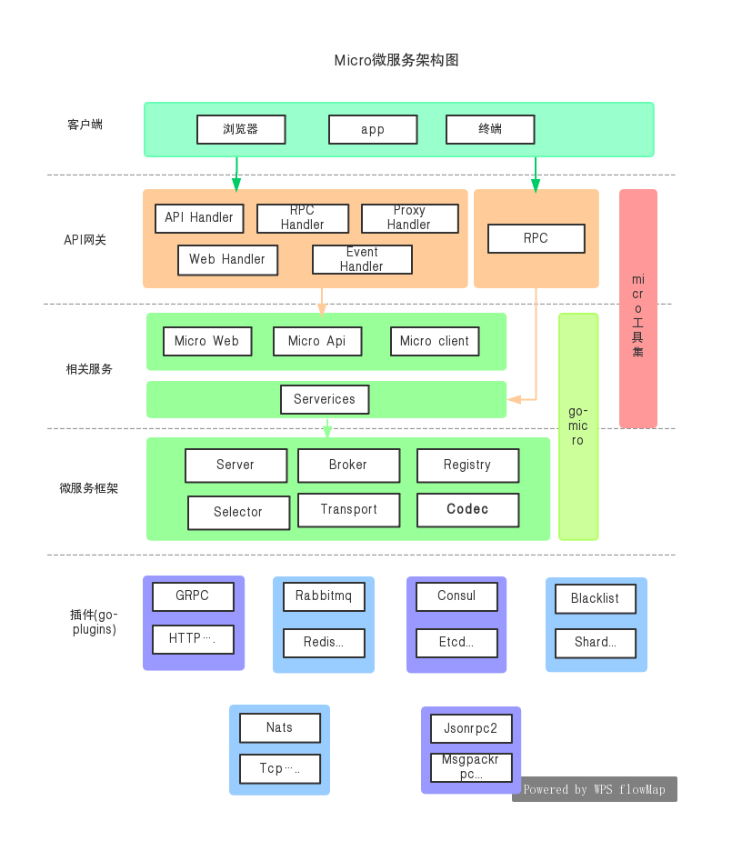

### 目录

* 配置 模块：
    1. [配置支持consul、etcd、静态文件作为配置中心](https://github.com/shabbyboy/MicroRpo/tree/master/conf)

* redis数据库模块：
    1. [对redgo 进行了封装，简化了redis的使用](https://github.com/shabbyboy/MicroRpo/tree/master/dbconn)
    
* 长连接和短连接模块
    1. [web包，利用websocket、发布订阅实现了tcp服务，短连接沿用了micro的web 处理模式](https://github.com/shabbyboy/MicroRpo/tree/master/web/userweb)
    2. [stream包，tcp 服务新增了个回调的模式，不再用发布订阅了](https://github.com/shabbyboy/MicroRpo/tree/master/stream)
        
* 日志模块
    1. [日志模块用的是logrus框架，要问原因，✨最多](https://github.com/shabbyboy/MicroRpo/tree/master/rpolog)
    
* sync 模块
    1. [同步模块，基于redis和mysql实现了两个分布式锁，以及进程锁](https://github.com/shabbyboy/MicroRpo/tree/master/rposync)
    
*  common 模块
    1. 加了个token 生成和解析的包
    
     
* 项目的bin目录用于存放执行文件
    
    1. 格式为：bin/包名/执行文件 
    2. 可以使用提供的build.sh 脚本编译代码
        
        执行脚本
        > sh build.sh
        
        Enter build path: 具体路径，这里是我自己的bin目录
        > Enter build path:/Users/tugame/newgodemo/microrpo/MicroRpo/bin 
        
        Enter code path: 代码路径，main.go 所在目录
        > Enter code path:/Users/tugame/newgodemo/microrpo/MicroRpo/web/userweb
    
    完成之后就可以在bin目录下看到 /userweb/userweb 的执行文件

* runlogs目录是日志输出目录，
    1. 格式：runlogs/包名/日志文件 例如：runlogs/userweb/web23967.log.2019-06-03
    

